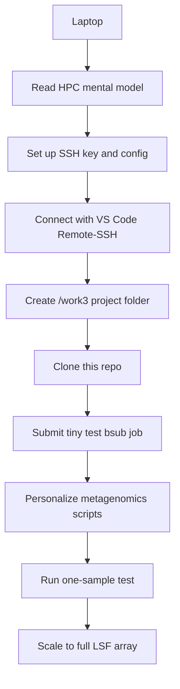

# DTU HPC Metagenomics Workflow Guide

> A practical, beginner-friendly guide for working on DTU HPC with SSH, VS Code Remote-SSH, LSF/`bsub`, and metagenomics job scripts for KneadData, MetaPhlAn, and HUMAnN.

This repository is meant to be a guide, not just a script dump. It explains the daily workflow from laptop to DTU HPC, from editing code to submitting jobs, and from raw sequencing files to processed metagenomics outputs.

> [!IMPORTANT]
> The included scripts are templates from real project work. Some shell and Python scripts still contain project-specific paths. Before running anything, replace project paths, sample counts, database paths, log paths, and Conda environments with your own values.

## Contents

- [Who This Repo Is For](#who-this-repo-is-for)
- [What DTU HPC Gives You](#what-dtu-hpc-gives-you)
- [Start Here](#start-here)
- [Repository Layout](#repository-layout)
- [Quickstart: Laptop to First Job](#quickstart-laptop-to-first-job)
- [How the Metagenomics Scripts Fit Together](#how-the-metagenomics-scripts-fit-together)
- [Safety Rules](#safety-rules)
- [Useful Commands](#useful-commands)
- [Official DTU References](#official-dtu-references)

## Who This Repo Is For

This repo is for DTU students, employees, and collaborators with DTU HPC access who need to:

| Need | Where to go |
| --- | --- |
| Understand what HPC is | [01 - HPC Mental Model](docs/01_hpc_mental_model.md) |
| Connect from a laptop | [02 - SSH and VS Code Remote-SSH](docs/02_ssh_and_vscode_remote.md) |
| Do a safe first session | [03 - First HPC Session](docs/03_first_hpc_session.md) |
| Submit and debug jobs | [04 - LSF Jobs and `bsub`](docs/04_lsf_jobs_and_bsub.md) |
| Move raw data/results | [05 - Transferring Data](docs/05_transferring_data.md) |
| Adapt this repo's scripts | [06 - Using This Repo for Metagenomics](docs/06_using_this_repo_for_metagenomics.md) |

If your department or group has a special queue, storage area, cluster, or login route, use that local guidance together with this repo. When in doubt, check the official DTU HPC documentation.

## What DTU HPC Gives You

DTU/DCC documents the LSF 10 cluster as open to DTU students and employees. If you are a DTU student or employee with valid DTU credentials, the DTU/DCC FAQ says you are already allowed to use the HPC cluster. Visitors need a DTU guest account with the relevant service enabled.

| Topic | Practical meaning |
| --- | --- |
| Access | DTU students/employees use DTU credentials. Access is case-sensitive. |
| Scheduler | DTU HPC uses LSF. You submit jobs with `bsub` and configure them with `#BSUB` lines. |
| Home storage | Each HPC user has a 30 GB backed-up home directory by default. Use it for code, config, and small important files. |
| Scratch storage | Scratch is temporary working storage for computation, commonly under `/work3/<dtu-user>`. It is not backed up. |
| Transfer node | Large transfers should use `transfer.gbar.dtu.dk` or the transfer host documented for your account, not login nodes. |
| General cluster | The Central DTU HPC Cluster is documented as a general compute resource for DTU staff and students. |
| Hardware examples | DTU/DCC lists mixed CPU nodes including Intel Xeon Gold, Intel Xeon Platinum, AMD EPYC, Infiniband-connected nodes, and memory configurations from 128 GB up to 1-1.5 TB per node. |

> [!NOTE]
> Hardware, queues, access rules, and hostnames can change. Treat the stats above as orientation and check the official DTU HPC pages for current details before requesting special hardware or planning a large run.

### Scratch Space

Scratch space is working space for computation: raw FASTQs, temporary files, databases, Conda environments, logs, and output folders. It is useful because metagenomics workflows can generate far more data than the 30 GB home quota can hold.

Scratch is not a backup. If you delete files there, they may not be recoverable. Move important final results to an approved backed-up location.

DTU/DCC's disk quota FAQ currently says to request scratch space by writing to:

```text
support@cc.dtu.dk
```

Include a short explanation of why you need it. Example:

```text
Subject: Request for /work3 scratch space for DTU HPC metagenomics project

Hello DTU HPC support,

I would like to request scratch space on /work3 for a metagenomics project.

DTU username: <dtu-user>
Project/group: <project-or-group>
Approximate storage needed: <size estimate>
Reason: I need working space for raw FASTQ files, reference databases,
KneadData/HUMAnN intermediate files, logs, and output tables.

Best regards,
<name>
```

After scratch space is created, read the `readme.txt` in the relevant scratch directory before using it.

## Start Here



Read these in order:

1. [01 - HPC Mental Model](docs/01_hpc_mental_model.md)
2. [02 - SSH and VS Code Remote-SSH](docs/02_ssh_and_vscode_remote.md)
3. [03 - First HPC Session](docs/03_first_hpc_session.md)
4. [04 - LSF Jobs and `bsub`](docs/04_lsf_jobs_and_bsub.md)
5. [05 - Transferring Data](docs/05_transferring_data.md)
6. [06 - Using This Repo for Metagenomics](docs/06_using_this_repo_for_metagenomics.md)

## Repository Layout

| Path | Purpose |
| --- | --- |
| `README.md` | Overview, orientation, and command cookbook. |
| `docs/01_hpc_mental_model.md` | Plain-language explanation of DTU HPC concepts. |
| `docs/02_ssh_and_vscode_remote.md` | SSH keys, SSH config, VS Code Remote-SSH, and troubleshooting. |
| `docs/03_first_hpc_session.md` | Step-by-step tutorial from SSH login to a tiny `bsub` job. |
| `docs/04_lsf_jobs_and_bsub.md` | Detailed explanation of `#BSUB` scripts, arrays, resources, logs, and debugging. |
| `docs/05_transferring_data.md` | `scp`, `rsync`, transfer node usage, data placement, and Git safety. |
| `docs/06_using_this_repo_for_metagenomics.md` | How the KneadData/HUMAnN/Python scripts fit together. |
| `hpc_lsf/` | LSF (`#BSUB`) job script templates. See [hpc_lsf/README.md](hpc_lsf/README.md). |
| `hpc_python/` | Python helper scripts. See [hpc_python/README.md](hpc_python/README.md). |
| `envs/` | Conda environment notes/exports. See [envs/README.md](envs/README.md). |
| `thesis_templates/` | Optional thesis templates. Not required for HPC workflows. |

## Quickstart: Laptop to First Job

This is the condensed path. The detailed version is in [03 - First HPC Session](docs/03_first_hpc_session.md).

1. Connect to DTU network/VPN if required.
2. Test SSH:

   ```bash
   ssh <dtu-user>@login1.hpc.dtu.dk
   ```

3. Set up an SSH key and `~/.ssh/config` using [02 - SSH and VS Code Remote-SSH](docs/02_ssh_and_vscode_remote.md).
4. Connect with VS Code Remote-SSH.
5. Create a project folder on scratch/project storage:

   ```bash
   mkdir -p /work3/<dtu-user>/<project>
   cd /work3/<dtu-user>/<project>
   ```

6. Clone this repo:

   ```bash
   git clone <repo-url> DTU_HPC_2026
   cd DTU_HPC_2026
   ```

7. Submit a tiny test job:

   ```bash
   mkdir -p logs
   cat > hello_lsf.sh <<'EOF'
   #!/bin/sh
   #BSUB -q hpc
   #BSUB -J hello_lsf
   #BSUB -W 00:05
   #BSUB -n 1
   #BSUB -R "rusage[mem=1GB]"
   #BSUB -M 1GB
   #BSUB -oo logs/hello_%J.out
   #BSUB -eo logs/hello_%J.err

   hostname
   date
   echo "Hello from an LSF job"
   EOF

   bsub < hello_lsf.sh
   bjobs
   ```

8. Inspect output:

   ```bash
   ls logs
   cat logs/hello_*.out
   ```

## How the Metagenomics Scripts Fit Together

| Stage | Purpose | Main files |
| --- | --- | --- |
| Raw data staging | Put raw FASTQs or sequencing archives on scratch/project storage. | [Transferring Data](docs/05_transferring_data.md) |
| Unpack/merge FASTQs | Convert delivered archives/lanes into paired FASTQs. | `hpc_lsf/unpack_merge_fastq.sh`, `hpc_python/unpack_merge_fastq.py` |
| KneadData | Remove host/contaminant reads and produce cleaned sample outputs. | `hpc_lsf/kneaddata_*.sh` |
| HUMAnN input prep | Merge KneadData paired reads into files expected by HUMAnN scripts. | `hpc_python/merge_pairs_for_humann.py` |
| HUMAnN | Profile pathways/gene families with HUMAnN/MetaPhlAn. | `hpc_lsf/humann38_*.sh` |
| Postprocess | Normalize, regroup, and merge tables. | `hpc_python/humann_postprocess.py`, `hpc_python/humann_merge_tables.py` |
| Summaries | Summarize read counts and QC outputs. | `hpc_python/kneaddata_read_summary.py`, `hpc_python/read_quality_hist.py` |

> [!WARNING]
> Do not submit the included LSF scripts unchanged. They are templates. Replace personal paths, sample counts, log paths, database paths, and Conda environments first.

## Safety Rules

| Rule | Why it matters |
| --- | --- |
| Do not run heavy analysis on login nodes. | Login nodes are shared and intended for coordination, editing, Git, and job submission. |
| Keep raw data out of Git. | FASTQs, archives, BAM/SAM files, databases, logs, and outputs can be huge or sensitive. |
| Use `/work3` or approved project storage for active data. | Home is 30 GB and intended for code/config/small files. |
| Check quota before large runs. | Full home/work storage can break VS Code, Conda, and jobs. |
| Use the transfer node for large transfers. | It avoids loading login nodes and is documented for large data movement. |
| Never commit secrets. | Private keys, passwords, tokens, and credentials must stay out of the repo. |

## Useful Commands

These are intentionally copy-pasteable. Replace placeholders before running.

### Connect to DTU HPC

```bash
ssh <dtu-user>@login1.hpc.dtu.dk
```

### Generate a Local SSH Key

Choose your own local key filename. The placeholder below is not a real key and must be replaced before running the command. Never commit private keys or paste their contents into this repo.

```bash
mkdir -p ~/.ssh
chmod 700 ~/.ssh
ssh-keygen -t ed25519 -f ~/.ssh/<your-dtu-hpc-key> -C "<dtu-user>@dtu-hpc"
```

### Install Public Key If `ssh-copy-id` Works

```bash
ssh-copy-id -i ~/.ssh/<your-dtu-hpc-key>.pub <dtu-user>@login1.hpc.dtu.dk
```

### SSH Config Template

```sshconfig
Host dtu-hpc-login
    HostName login1.hpc.dtu.dk
    User <dtu-user>
    IdentityFile ~/.ssh/<your-dtu-hpc-key>
    IdentitiesOnly yes
    ServerAliveInterval 60
    ServerAliveCountMax 5

Host dtu-hpc-transfer
    HostName transfer.gbar.dtu.dk
    User <dtu-user>
    IdentityFile ~/.ssh/<your-dtu-hpc-key>
    IdentitiesOnly yes
    ServerAliveInterval 60
    ServerAliveCountMax 5
```

### Create and Enter Project Folder

```bash
mkdir -p /work3/<dtu-user>/<project>
cd /work3/<dtu-user>/<project>
```

### Clone This Repo on HPC

```bash
git clone <repo-url> DTU_HPC_2026
cd DTU_HPC_2026
```

### Start a Light Interactive Session

```bash
linuxsh
hostname
pwd
exit
```

### Submit a Job

```bash
mkdir -p logs
bsub < hpc_lsf/<script>.sh
```

### Monitor Jobs

```bash
bjobs
bjobs -l <job-id>
bstat
bpeek <job-id>
bhist -l <job-id>
```

### Cancel a Job

```bash
bkill <job-id>
```

### Check Home Quota

```bash
getquota_zhome.sh
cd ~ && du -h --max-depth=1 .
```

### Check Scratch Quota and Project Size

```bash
getquota_work3.sh
du -sh /work3/<dtu-user>/<project>
```

### Transfer Data to HPC With `rsync`

```bash
rsync -avP local_fastq_folder/ dtu-hpc-transfer:/work3/<dtu-user>/<project>/input_fastq/
```

### Transfer Results Back

```bash
rsync -avP dtu-hpc-transfer:/work3/<dtu-user>/<project>/results/ ./results/
```

### Dry Run a Large Transfer

```bash
rsync -avP --dry-run local_fastq_folder/ dtu-hpc-transfer:/work3/<dtu-user>/<project>/input_fastq/
```

### Count Samples and Set Array Size

```bash
wc -l /work3/<dtu-user>/<project>/kneaddata_project/samples.txt
```

### Find Project-Specific Paths Before Running Scripts

```bash
grep -R "/work3/" hpc_lsf hpc_python
grep -R "<old-user-or-project-name>" hpc_lsf hpc_python
```

### Activate Conda in a Batch Script

```bash
source /work3/<dtu-user>/<project>/miniconda3/etc/profile.d/conda.sh
conda activate <env-name>
which python
```

## Official DTU References

Check official DTU HPC documentation for current details:

- DTU/DCC access FAQ: <https://www.hpc.dtu.dk/?page_id=862>
- DTU/DCC access guide: <https://www.hpc.dtu.dk/?page_id=2501>
- DTU/DCC LSF jobs: <https://www.hpc.dtu.dk/?page_id=1416>
- DTU/DCC job monitoring: <https://www.hpc.dtu.dk/?page_id=1519>
- DTU/DCC storage: <https://www.hpc.dtu.dk/?page_id=59>
- DTU/DCC disk space and quota FAQ: <https://www.hpc.dtu.dk/?page_id=927>
- DTU/DCC LSF 10 overview: <https://www.hpc.dtu.dk/?page_id=2513>
- DTU/DCC Central DTU HPC Cluster: <https://www.hpc.dtu.dk/?page_id=2520>
